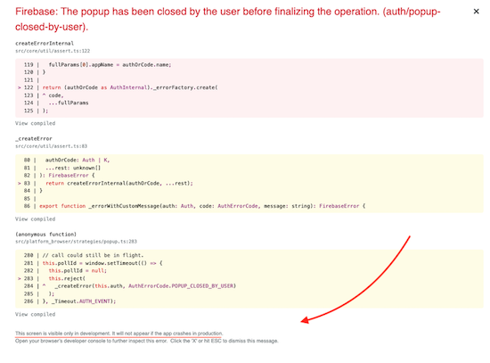

# Shop-React-Five

 &nbsp; 

> on-going :turtle: - we're all turtles

 

Todo
-----

1. [X] Signin/Signout/Signup working. session/withAuthentication HOC
  
2. [ ] A redux store  - users - products etc.
3. [ ] Need larger images

  

------

  

### Firebase: Signin with Google

[Not an error]
Closing the Google Signin popup will throw this error ONLY in development

 

 
   

### Initial layout  :rocket:

----

p- 380 x 491

